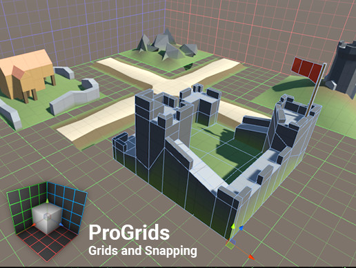
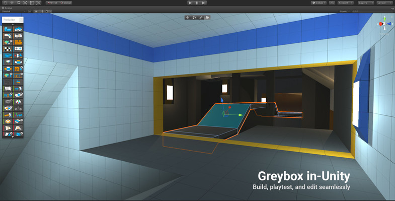
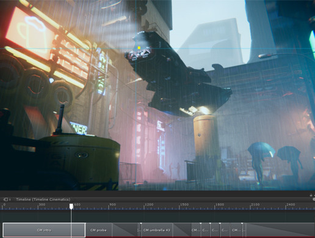
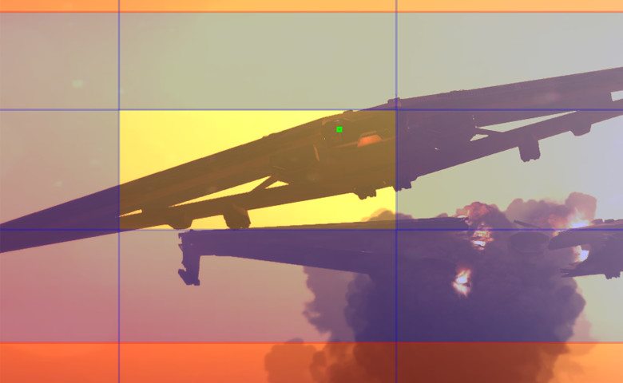
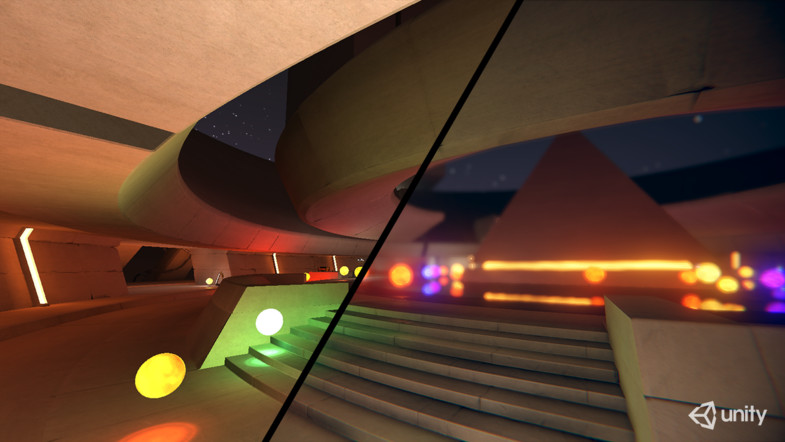
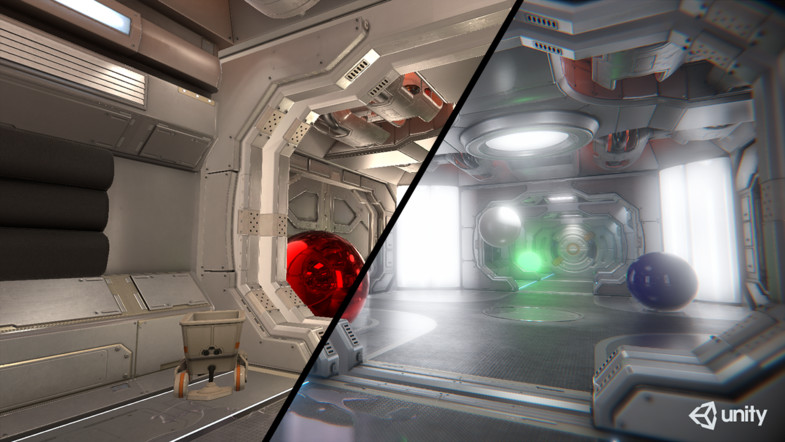
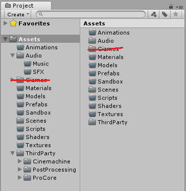
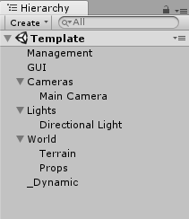

# Useful Assets
Assets provided by Unity Technologies 1.

@fa[code](ProGrids & ProBuilder)

@fa[code](Cinemachine)

@fa[code](Post Processing Stack)

@fa[file](https://goo.gl/YiAX9i)

#### Nathan Bowman

---

## Progrids

[Asset Link](https://assetstore.unity.com/packages/3d/progrids-111425)

@fa[arrow-down]()

+++

### Design Quickly, Build Precisely 

#### ProGrids gives you simple, functional grids and snapping for use with: 

- Aligning items and prefabs 
- Greyboxing in ProBuilder 
- Eliminating mesh gaps and light leaks 
- Modular level design

---

## Probuilder

[Asset Link](https://assetstore.unity.com/packages/tools/modeling/probuilder-111418)

@fa[arrow-down]()

+++

### Prototype Rapidly
Build basic or advanced geometry, right in Unity, with zero creative barriers.

### Play Instantly
Playtest at any time, then edit immediately, and never leave Unity. No time (or sanity) wasted.

### Perfect Easily
Go advanced with complete UV unwrapping and more, or export your models and detail externally.

@fa[arrow-down]()

+++

---

## Cinemachine

[Asset Link](https://assetstore.unity.com/packages/essentials/cinemachine-79898) Unity 2017.1.1+ (works 2017.1.0f3)

@fa[arrow-down]()

+++

### Procedural camera system for in-game cameras, cinematics and cutscenes.

- Procedural composition
- ***Follow modes***
- ***Clear Shot***
- ***Multi-point targeting***
- Collision system
- Free Look
- State Drive Camera module
- ***Dolly Track***
- ***Priority***
- ***Blend List***
+++

---

## Post Processing Stack

[Asset Link](https://assetstore.unity.com/packages/essentials/post-processing-stack-83912)

@fa[arrow-down]()

+++

- Antialiasing (FXAA, Temporal AA)
- ***Ambient Occlusion***
- Screen Space Reflections
- Fog
- Depth of Field
- Motion Blur
- Eye Adaptation
- ***Bloom***
- ***Color Grading*** / User Lut
- Chromatic Aberration
- Grain / Vignette
- Dithering

@fa[arrow-down]()

+++

---

## Sample Project

A sample project is available so we can jump right in.

@fa[arrow-down gp-tip](https://github.com/NateBowman/Cine-ProBuilder/archive/master.zip)

---

## Project Setup

Keeping an organised project is important.

Structure > Chaos

+++

## Scene Setup

A tidy scene makes editing easier.

---

## ProGrids Intro

Switch to unity for demo.

- Open scene menu (Tools > ProGrids > ProGrids Window)
- Tweak asset settings (Edit > Preferences)
- Snap settings
- Toggle Grid
- Toggle Snap
- Lock Grid
- 2D planes / 3D Grid

---

## ProBuilder Intro

Switch to unity for demo.

- Open scene menu (Tools > ProBuilder > ProBuilder Window)
- Tweak ProBuilder settings (Edit > Preferences)
- New Shape
- ProBuilder Modes
- Poly Shape
- Materials
- Mover / Detail / Trigger / Collider
- Export / Prefab

---

## Cinemachine

Switch to unity for demo.

- Virtual Camera
- Cinemachine Brain
- Clear Shot
- Blend List
- Dolly Track / Cart / Camera
- Target group

---

## Post Processing Stack

- Post Processing / Asset
- Antialiasing
- Depth of Field
- Bloom
- Color Grading / Dithering
- Grain / Vignette  / Chromatic Aberation

---?image=assets/image/gitpitch-audience.jpg&opacity=100
### Questions?

---

### Next time?

- Timelines and behaviours
- Simple particles
- ???